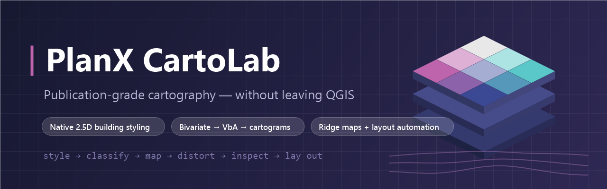

<div align="center">



# PlanX CartoLab

**Publication-grade cartography — without leaving QGIS.**

[](https://github.com/YusufEminoglu/planx_cartolab/releases)
[](LICENSE)
[](https://qgis.org)
[](docs/index.html)
[](https://github.com/YusufEminoglu/PlanX)

The map types journals and design studios actually ask for —
**2.5D buildings, bivariate choropleths, Value-by-Alpha, cartograms, ridge maps and automated layouts** — as native QGIS styling, not fragile pasted QML.

[Install](#-installation) · [Modules](#-module-catalog) · [2.5D styling](#-25d-building-styling) · [Showcase](#-showcase) · [Türkçe](#-türkçe-özet)

</div>

---

## ✨ Why CartoLab?

| | |
|---|---|
| 🏢 **2.5D that survives** | A native QGIS `25dRenderer` engine with presets, per-floor colour bands and one legend rule per floor — a reusable, legend-friendly replacement for ad-hoc QML extrusion hacks. One click exports the style back to QML. |
| 🎨 **Dual-variable honesty** | Bivariate choropleths (3×3 palettes, custom corner colours) and **Value-by-Alpha** maps that fade unreliable values instead of hiding them — reliability-aware visualisation built in. |
| 📐 **Classification for skewed cities** | Adaptive Geometric Interval, Fisher-Jenks and Head/Tail Breaks — made for the long-tailed indicators urban data actually has. |
| 🗺 **Shape as data** | Continuous-area **cartograms** distort polygons by value; **ridge-line maps** turn any raster (DEM, heat, density, accessibility) into joy-division-style relief. |
| 🖨 **Layout automation** | Print-layout assembly with rotated diamond/square bivariate legends, isometric layer stacks, minimalist grids and typography hierarchy — the last mile to publication. |

Built for planners, urban researchers, studios and academic cartography workflows.

---

## 🛠 Module Catalog

Everything is reachable from the **CartoLab Dashboard** (`Plugins → PlanX CartoLab`) and the **Processing Toolbox → PlanX CartoLab** provider:

| Module | What it does | Surface |
|---|---|---|
| **2.5D Building Styling** | Height/floor-field extrusion, material presets, shadows, wall shading, stepped floors, per-floor colour bands, QML export | Dashboard panel + Processing |
| **Bivariate Choropleth** | Two variables, one map; 3×3 palettes incl. custom corner colours; diamond/square legends | Processing + layout |
| **Value-by-Alpha** | Value drives hue, reliability drives opacity | Processing |
| **Cartogram** | Continuous-area distortion proportional to a value field | Processing |
| **Ridge Map** | Raster surface → stacked ridge lines | Processing |
| **Adaptive Classification** | Geometric Interval, Fisher-Jenks, Head/Tail Breaks | Processing |
| **Feature Inspector** | Floating HTML feature cards with radar-style attribute charts | Dashboard |
| **Layout Automation** | Bivariate legends, isometric stacks, grids, typography | Print Layout |

---

## 🏢 2.5D Building Styling

The flagship module — a better, reusable version of the QML extrusion styles planners pass around:

- **Native renderer**, not a pasted QML block: stable across projects and QGIS versions.
- **Floor-count mode** for fields like `Kat_Sayisi`: rendered height = floors × floor height (default 3.5 map units).
- **Per-floor colour bands** with selectable palettes and **automatic maximum-floor detection** — every floor band gets its own colour *and its own QGIS legend entry*.
- Optional **floor-step snapping** for planning-height layers, soft shadows, directional wall shading.
- **One-click QML export** for reuse anywhere.

> Quick recipe: open **2.5D Styling**, pick the polygon layer and `Kat_Sayisi`, set *Height source* → *Floor count field*, enable *Colour each floor separately*, leave *Maximum floor bands* on *Auto from layer*. Done — extruded, banded, legend-ready.

---

## 🖼 Showcase

An interactive, GitHub Pages-ready showcase lives in [`docs/index.html`](docs/index.html) — 2.5D canvas scene, feature map, workflow narrative and publication-oriented positioning.

```text
GitHub Pages source →  Branch: master   Folder: /docs
```

More: [Documentation index](docs/README.md) · [Feature showcase](docs/SHOWCASE.md) · [Architecture](docs/ARCHITECTURE.md) · [Publishing notes](docs/PUBLISHING.md)

---

## 📦 Installation

**From QGIS Plugin Hub** *(recommended)*
> `Plugins → Manage and Install Plugins…` → search **PlanX CartoLab** → Install.

**From ZIP**
> Download the latest zip from [Releases](https://github.com/YusufEminoglu/planx_cartolab/releases) → `Plugins → Install from ZIP`.

| Requirement | Value |
|---|---|
| QGIS | **3.28 LTR → 4.x** |
| Python | 3.9+ |
| External dependencies | None — pure QGIS for all core operation |
| License | [GPL-3.0](LICENSE) |

```text
planx_cartolab/
  core/        # Symbology engines, 2.5D renderer helpers, math logic
  processing/  # QGIS Processing algorithms
  layout/      # Print Layout automation
  ui/          # Dashboard, 2.5D panel, feature inspector
  docs/        # GitHub Pages showcase (excluded from the Hub zip)
```

---

## 🇹🇷 Türkçe Özet

**PlanX CartoLab**, sıradan CBS katmanlarını **yayın kalitesinde analitik haritalara** dönüştüren bir QGIS eklentisidir:

- **2.5D bina stillemesi:** `Kat_Sayisi` gibi kat alanlarından yerli QGIS renderer ile ekstrüzyon; **kat başına renk bandı ve lejant satırı**, otomatik en yüksek kat tespiti, gölge/duvar gölgelemesi ve tek tıkla QML dışa aktarımı. Elden ele dolaşan kırılgan QML bloklarının kalıcı, yeniden kullanılabilir hâli.
- **İki değişkenli haritalar:** Bivariate koroplet (3×3 palet, özel köşe renkleri, eşkenar/dörtgen lejantlar) ve güvenilirliği saydamlıkla gösteren **Value-by-Alpha**.
- **Şehir verisine göre sınıflama:** Geometrik Aralık, Fisher-Jenks ve Head/Tail Breaks — çarpık dağılımlı kent göstergeleri için.
- **Kartogram ve sırt haritaları:** Değerle orantılı poligon bozulması; DEM/ısı/yoğunluk rasterlarından ridge-line haritalar.
- **Sayfa düzeni otomasyonu:** Bivariate lejantlar, izometrik katman istifi, tipografi hiyerarşisi — yayına giden son adım.

Kurulum: QGIS → *Eklentiler → Eklentileri Yönet ve Kur* → **PlanX CartoLab** aratın. Pano: *Eklentiler → PlanX CartoLab → CartoLab Dashboard*.

---

## 🧩 Part of the PlanX ecosystem

This plugin is one of 15 open-source QGIS plugins for urban planning by the same author:

| Planning & analysis | CAD & production | 3D & visualization |
|---|---|---|
| [PlanX](https://github.com/YusufEminoglu/PlanX) — spatial-planning suite | [PlanX CAD Toolset](https://github.com/YusufEminoglu/PlanX-CAD) — drafting-grade CAD | [PlanX 3D City](https://github.com/YusufEminoglu/planx_3d_city) — Three.js city viewer |
| [GeoStats Lab](https://github.com/YusufEminoglu/planx_geostats) — spatial statistics | [EasyFillet](https://github.com/YusufEminoglu/EasyFillet) — tangent-arc fillet | [3D OSM Model](https://github.com/YusufEminoglu/osm_3d_model) — OSM → 3D city in browser |
| [Suitability Lab](https://github.com/YusufEminoglu/planx_suitability_lab) — raster MCDA | [Settlement Toolset](https://github.com/YusufEminoglu/PlanX-Settlement) — 9-stage settlement plans | [OSM Quick 3D](https://github.com/YusufEminoglu/osm_quick_3d) — OSM → native QGIS 3D |
| [DataCube Lab](https://github.com/YusufEminoglu/planx_datacube) — spatiotemporal cubes | [UIP Toolset](https://github.com/YusufEminoglu/PlanX-UIP) — Turkish master-plan automation | [Urban Procedural 3D](https://github.com/YusufEminoglu/planx_urban_procedural_3d) — parametric zoning lab |
| [Urban Resilience](https://github.com/YusufEminoglu/planx_urban_resilience) — 28 resilience tools | [ParcelFlux](https://github.com/YusufEminoglu/parcelflux) — parcel subdivision | [CartoLab](https://github.com/YusufEminoglu/planx_cartolab) — publication cartography |

---

## 🤝 Contributing & Support

- 🐛 **Bugs / requests** → [Issues](https://github.com/YusufEminoglu/planx_cartolab/issues)
- 📜 **Changelog** → [CHANGELOG.md](CHANGELOG.md) follows *Keep a Changelog*
- ✅ Before a PR: `py -3 tests/test_core.py` (headless, no QGIS required)

## 👤 Author

**Yusuf Eminoğlu** — urban planner & developer
Department of City and Regional Planning, Dokuz Eylül University
[GitHub](https://github.com/YusufEminoglu) · yusuf.eminoglu@deu.edu.tr

<div align="center">
<sub>Maps people pin to walls. If CartoLab elevates your output, a ⭐ helps others find it.</sub>
</div>
